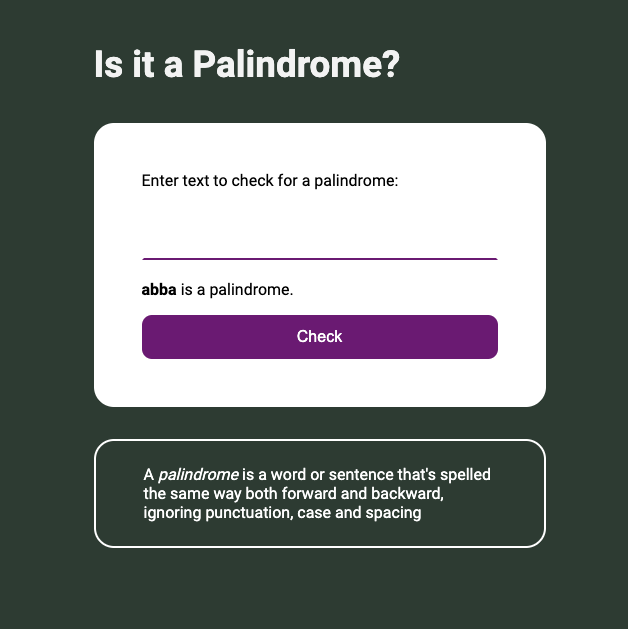

## Palindrome Checker

### The challenge:

Build a simple app in HTML, CSS and JavaScript that verifies if user input is a palindrome or not.

### Process

- Create draft of README file
- Create .gitignore file
- Create Github repository
- Work on HTML, CSS and JS files
- Check final code and accessibility
- Finalize README file
- Publish live URL
